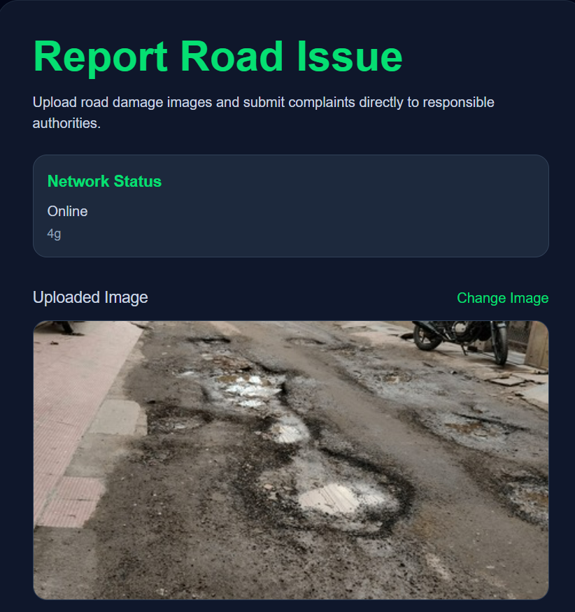
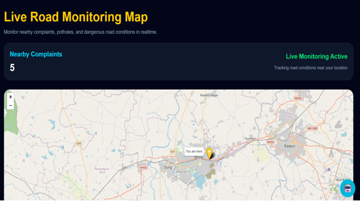
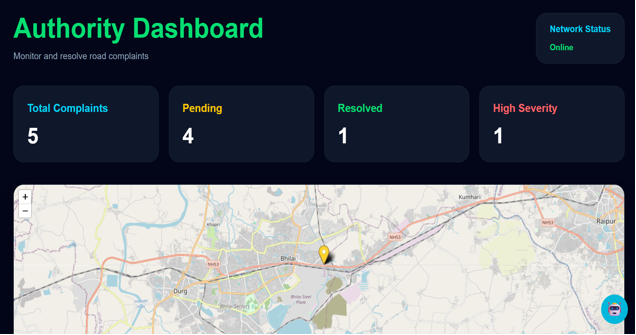
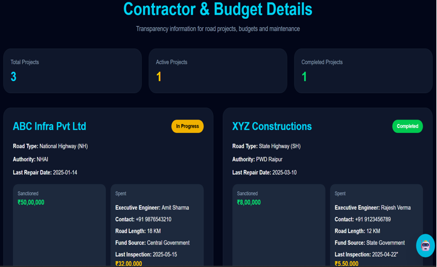
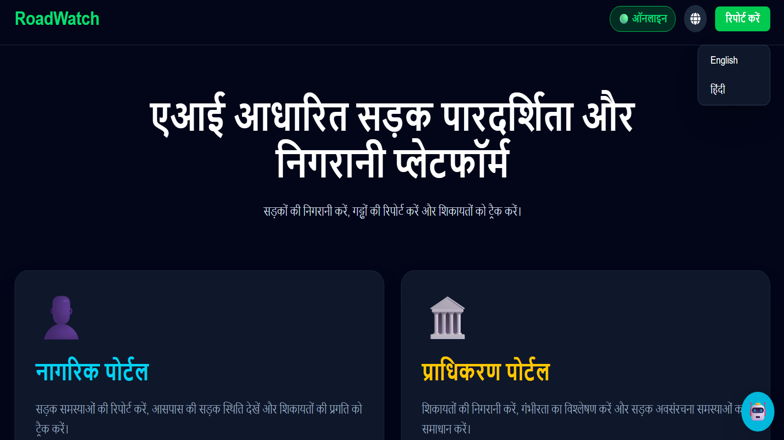

<p align="center">
  
</p>

<h1 align="center">
🚧 iRoadWatch AI
</h1>

<p align="center">
AI-Powered Road Infrastructure Monitoring & Transparency Platform
</p>

<p align="center">

  
  
  
  
  
  
</p>

---

## 📖 Overview

**iRoadWatch AI** is an intelligent road infrastructure monitoring platform designed to improve road maintenance, citizen participation, and public transparency.

The platform allows citizens to report road issues using **images**, **GPS-enabled location**, and **AI-assisted analysis**, while providing authorities with a centralized dashboard for complaint management, contractor monitoring, budget transparency, and real-time infrastructure analytics.

By integrating AI, cloud technologies, interactive mapping, and multilingual support, the system promotes efficient maintenance, improved accountability, and safer transportation systems.

---

# ✨ Key Features

### 🚧 Citizen Services

- 📸 Image-based road issue reporting
- 📍 Automatic GPS location capture
- 📱 Offline complaint submission
- 🌐 Hindi & English language support
- 📋 Complaint history & tracking

### 🤖 AI Features

- AI-assisted road issue analysis
- Smart complaint categorization
- AI Chat Assistant
- Intelligent road information retrieval

### 🗺 Road Monitoring

- Interactive live road map
- Severity-based complaint visualization
- Real-time monitoring dashboard
- Road maintenance history

### 🏛 Authority Dashboard

- Real-time complaint management
- Complaint prioritization
- Resolution workflow
- Road analytics
- Maintenance monitoring

### 💰 Transparency Portal

- Contractor information
- Engineer details
- Budget allocation
- Budget utilization
- Inspection history
- Maintenance records

---

# 🏗 System Architecture

```
                    Citizen
                       │
        ┌──────────────┴──────────────┐
        │                             │
 Report Road Issue              AI Assistant
        │                             │
        └──────────────┬──────────────┘
                       │
               GPS + Image Upload
                       │
                       ▼
            Firebase Cloud Firestore
                       │
        ┌──────────────┼──────────────┐
        │              │              │
 Authority Dashboard   Road Map   Complaint Tracking
        │              │              │
        └──────────────┼──────────────┘
                       │
                Contractor Portal
                       │
                       ▼
                Complaint Resolution
```

---

# 🚀 Workflow

```text
Citizen Reports Issue
        │
        ▼
Upload Image + GPS
        │
        ▼
AI Analysis
        │
        ▼
Complaint Stored in Firebase
        │
        ▼
Authority Dashboard
        │
        ▼
Road Monitoring Map
        │
        ▼
Contractor Assignment
        │
        ▼
Maintenance Work
        │
        ▼
Complaint Resolved
```

---

# 🛠 Tech Stack

| Category | Technology |
|----------|------------|
| Frontend | React.js + Vite |
| Styling | Tailwind CSS |
| Database | Firebase Firestore |
| Authentication | Firebase Authentication |
| Maps | Leaflet.js |
| Map Provider | OpenStreetMap |
| Location | Geolocation API |
| Programming | JavaScript |
| Development | VS Code |
| Version Control | Git & GitHub |

---

# 📂 Project Structure

```
RoadWatchAI/
│
├── public/
├── src/
│
├── components/
├── pages/
├── services/
├── hooks/
├── utils/
├── assets/
│
├── screenshots/
├── README.md
├── package.json
└── vite.config.js
```

---

# 📸 Application Screenshots

## 🏠 Home Page


---

## 🚧 Report Issue



---

## 📋 AI Detection


---

## 🗺 Live Road Monitoring



---

## 🏛 Authority Dashboard



---

## 💰 Contractor Transparency



# Multilingual 



---

# ⚙ Installation

Clone the repository

```bash
git clone https://github.com/aanyacloud/RoadWatchAI-CivicEyee.git
```

Move into the project

```bash
cd RoadWatchAI-CivicEyee
```

Install dependencies

```bash
npm install
```

Start development server

```bash
npm run dev
```

---

# 🔥 Core Modules

- Citizen Portal
- Complaint Management
- AI Assistant
- Authority Dashboard
- Road Monitoring Map
- Contractor Transparency
- Budget Dashboard
- Offline Synchronization
- Multilingual Support

---

# 📊 Database Collections

### complaints

- Description
- GPS Coordinates
- Images
- Severity
- Status
- Timestamp

### road_metadata

- Contractor
- Engineer
- Budget
- Repair History
- Inspection Records

### authorities

- Login
- Authority Details
- Administration

---

# 🎯 Project Highlights

✅ AI-assisted road monitoring

✅ GPS-enabled complaint reporting

✅ Interactive GIS visualization

✅ Real-time Firebase synchronization

✅ Offline complaint support

✅ Budget transparency

✅ Contractor accountability

✅ Multilingual accessibility

✅ Citizen engagement

---

# 🚀 Future Enhancements

- AI-based road damage severity estimation
- Predictive road failure detection
- AI maintenance scheduling
- Government API integration
- Mobile application deployment
- Smart city analytics
- RAG-powered AI Assistant
- Push notifications
- Analytics dashboard

---

# 🤝 Contributing

Contributions are welcome!

1. Fork the repository
2. Create your feature branch

```bash
git checkout -b feature/new-feature
```

3. Commit changes

```bash
git commit -m "Add new feature"
```

4. Push changes

```bash
git push origin feature/new-feature
```

5. Open a Pull Request

---

# 📜 License

This project is licensed under the MIT License.

---

# 👩‍💻 Author

**Aanya**

B.Tech Computer Science & Engineering  
IIIT Naya Raipur

🔗 GitHub: https://github.com/aanyacloud

---

# ⭐ Support

If you found this project useful, consider giving it a ⭐ on GitHub!

It helps the project gain visibility and motivates further development.